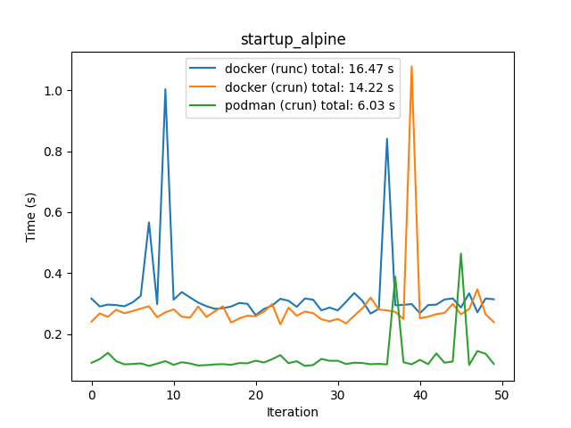
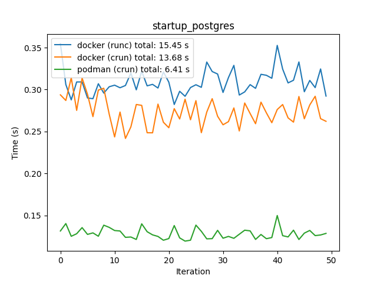
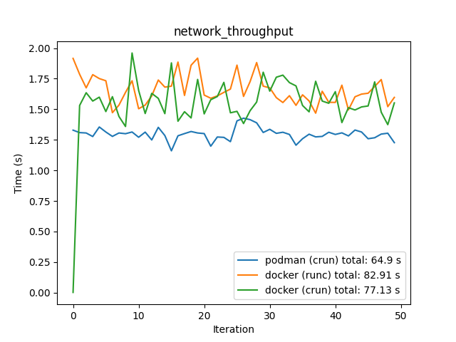

# Motivation
To benchmark the performances of two OCI runtimes: `runc` (of Docker fame) and `crun` (of Redhat fame), using Podman (with cgroups1) and Docker as the OCI container engines. We're using these two runtimes, because they create containers with the same tools -- namespace isolations, so it makes sense to compare them.

## What is an OCI, anyway?
OCI stands for _Open Container Iniciative_ and it develops industry standards for the ecosystem around containers. Honestly, the whole container ecosystem is a hot mess. Below are some articles I found that provide some overview, in the order they should probably be read. The TL;DR is Docker and Podman are "high-level CLI interfaces" for a user to interact with containers. Their implementation differs: Docker uses a Docker daemon, which runs under root, to coordinate everything, while Podman's architecture interacts with the appropriate services (image registry, etc) directly; not requiring root access. After an image is prepared (a JSON in a standardized format, OCI Image Specification), it has to be executed by a runtime. Traditionally, the runtime executes the container using Linux kernel tools like process/network/file namespaces, but the container can also be executed as a lightweight VM (see Kata containers). We will evaluate two "traditional" runtimes, `runc` and `crun`. The former is a reference implementation of a OCI runtime provided by the Docker team and is written in Go. The latter comes from Redhat and is written in C. 

- https://www.tutorialworks.com/difference-docker-containerd-runc-crio-oci/
- https://developers.redhat.com/blog/2018/02/22/container-terminology-practical-introduction
- https://www.ianlewis.org/en/container-runtimes-part-1-introduction-container-r (Series of articles)
- https://www.capitalone.com/tech/cloud/container-runtime/

## Configuring Docker
Docker comes with `runc` by default. Install `crun` from your package manager of choice if available. If not (e.g. Ubuntu 20.04 does not have it), then clone https://github.com/containers/crun and install it locally, using the instructions in the repo. 

Once that's done, you need to register `crun`. Add this to `/etc/docker/daemon.json`:
```json
{ "runtimes": { "crun": { "path": "/usr/local/bin/crun" } } }
```

Then, restart Docker daemon with `sudo systemctl restart docker`. Verify `crun` works with `docker run -it --rm --runtime=crun wernight/funbox nyancat`.

## Configuring Podman
Podman's default runtime is `crun` (check with `podman info`). Verify `runc` works with `podman run -it --rm --runtime=runc wernight/funbox nyancat`. 

If you get something like `Error: container_linux.go:349: starting container process caused "error adding seccomp filter rule for syscall bdflush: permission denied": OCI permission denied`, you're in trouble. See https://github.com/containers/common/issues/631. I did not manage to resolve this issue, so `podman` is measured only with the `crun` runtime.

## Benchmarks
It is very important to realize what we should and should not measure. The job of an OCI container engine is to process input from the user and delegate the task to an OCI runtime. The runtime then creates a container using OS primitives, such as process, filesystem and network namespaces and then it hands over the control to the OS, as the container is just another process, just a bit special. Thus, for example, it does not really make sense to measure the performance of an app inside the container, because once the container is created, the runtime no longer has any control over it. On the other hand, the overhead of creating a container makes sense to measure -- different runtimes might take a different time to prepare the container.
###  Startup time
We want to measure the amount of time it takes from issuing a command to start a container to the container starting. There are two factors that determine this overhead: the Container Engine and the OCI. Two container images will be used: a minimal one based on `alpine` and a reasonably large one, containing `postgres`. To measure the time, a timestamp is taken, then a container is created with a command to print out the current time (we can do this because the containers use the same clock as the host). Subtracting these two times gives us a duration it took for a container to becoming operational. Technically, we could also use the `startContainer` OCI hook. 

#### Initialization
The `init.sh` script pulls the two used images used for testing, `alpine` and `postgres`, to ensure they won't be pulled in the first execution of the benchmark.

#### Execution
Run the `./run.sh` script and see the graphs in `./graphs`, or keep reading to see the graphs below.

### Networking
Another thing we can measure is networking. Specifically, the host <-> container networking, because that's the direction used when the container is exposed to the outside world; usually when it provides some kind of a service. To achieve network isolation for containers, Docker uses [iptables](https://docs.docker.com/network/iptables/) (which is also the reason Docker doesn't play nice with UFW). Podman relies on the (https://github.com/containernetworking/plugins)[containernetworking plugins] library (for rootful containers; we won't consider rootless containers here as Docker is (usually) running rootful containers).

To measure the throughput, a container will be launched with port 9001 bind-mounted to the host, with `[docker|podman] run --rm --log-driver=none --name docker_nc -p 9001:9001 appropriate/nc:latest -lk 9001`. We use a container with nc, because the one in alpine is non-standard and doesn't behave nicely. We also disable logging for the container, because nc will output what it received to stdin, so it would fill up the logs. On the host, we will measure how long it takes to transfer a 1 GB file (`dd if=/dev/urandom of=1gb.img bs=1 count=0 seek=1G`) to the container, with ` time nc -q 0 localhost 9001 < 1gb.img`.


# Results

## Startup time

### Alpine container


We can see `crun` being slightly faster than `runc` and Podman being faster than docker. All three scenarios experienced unusually high spikes in total duration.

### Postgres container


The results are similar to the Alpine scenario, but the spikes are absent this time.


### Discussion

Overall, it seems like the startup performance is not that much dependent on the runtime, but it's tied to the CLI interface. For bare-bones Alpine image, for both runtimes (excluding the spikes), Docker took roughly 0.3 seconds on average, but Podman took roughly 0.1 second. For a larger, more complex Postgres image, Docker also took 0.3 seconds, while Podman was still at 0.12 seconds. Interestingly, `runc` performed better in Docker, but `crun` performed better in Podman. 


It is time to investigate the spikes that happened for both runtimes. Clearly, it's not specific to a runtime or a CLI interface, as it's happening in all combinations of these. Because the tests are performed back-to-back and each one utilizes many kernel syscalls to setup the namespaces for the container, it is possible the kernel needs to perform some kind of "garbage collection" under a shared lock after a couple of containers is created, thus causing the spikes. Interestingly, the spikes are not as prominent in the Postgres scenario, compared to the Alpine one. 

Adding a `sleep 1` to the benchmarking functions (see `SLEEP_BETWEEN` in `./bench_init.sh` to allow the kernel some rest between each container creation and teardown does not help (the graphs are already with the 1 second delay). It's time to investigate deeper.

We suspect there's a syscall that takes a long time to resolve, causing the spike. Run the following script a couple of times until the command takes abnormally long to execute (e.g. 0.8 seconds, compared to a normal 0.5 second duration. Note the duration of the execution increases overall, because of the overhead introduced by `strace`) `tstrace -f -wc -o strace.log docker run -it --rm -e TZ=$timezone alpine:3.14.1 /bin/sh -c "adjtimex | awk '/(time.tv_sec|time.tv_usec):/ { printf(\"%06d\", \$2) }'"`. Note the `-wc` flag that will make strace count the walltime between the start and end of each syscall.


```
% time     seconds  usecs/call     calls    errors syscall
------ ----------- ----------- --------- --------- ----------------
 87,05    3,803651        5290       719       131 futex
 11,90    0,520055       14055        37           epoll_pwait
  0,84    0,036661         154       238           nanosleep
  0,07    0,003261         407         8           write
< the rest removed for brevity >
------ ----------- ----------- --------- --------- ----------------
100.00    4,369609                  1672       163 total


real    0m0,566s
user    0m0,034s
sys     0m0,029s

```

Interestingly, the wall clock time, `real` is much higher than `user` and `sys`. This indicates the system is spending most of it's time waiting and not doing anything, which is confirmed by the high amount of `futex` calls taking most of the execution time, some of them ending up in errors. Upon manual inspection (removing the `-wc` flag), the errors are `EAGAIN (Resource temporarily unavailable)`. Substituting `podman` for `docker` yields similar results. Another important thing to realize is the `strace` is measuring the time it takes to build up _and_ tear down the container, while we were measuring only the startup time at the start. However, a quick inspection of the syscalls reveals most of the `futex` waiting time is done before the container outputs the timestamp. Changing the command to `"sleep 3; adjtimex | awk '/(time.tv_sec|time.tv_usec):/ { printf(\"%06d\", \$2) }'"` does significantly increase the time of the `futex` calls too.

It seems like the blocking syscalls are mostly waiting for something to happen with the container, for example IO. `strace` does not follow the actual container process, so perhaps there's some delay happening inside the container. I tried looking into setting real-time priority for the container to perhaps avoid some scheduling weirdness (though a scheduler should not cause spikes high up to 1 second), but apparently there be dragons, when it comes to enabling these features.

Overall, a deeper investigation would have to be performed. Because the spikes do not happen in the postgres scenario, I ultimately assume the issue lies in the executed command, `/bin/sh -c "adjtimex | awk '/(time.tv_sec|time.tv_usec):/ { printf(\"%06d\", \$2) }'")` and my gut feeling is it's probably the `ajdtimex` part. Perhaps there's some sort of time synchronization that causes the `ajdtimex` call to hang. However, attaching `strace` to a container looks a bit complicated. 

### Network performance
Measuring the time it takes to transport a 1GB file from the host to the container. Note the log driver is disabled for this experiment, so the receiving netcat won't output a 1GB log file (containing the contents of the file).

#### Docker & Podman - network throughput


The results are clear here - Podman's networking implementation is more efficient than Docker's. At first glance, it does not seem like the runtime matters in network performance as expected, because the runtime's job is over when the container is launched. The unusually low time in the first iteration in the Docker + crun scenario is probably caused by the container not yet being prepared to receive a connection, so the netcat that tried to connect to it ended prematurely.


## Conclusion
We conclude that Podman performs faster than Docker and that `crun` performs faster than `runc`, in the two tested scenarios: network throughput and container initialization time. We did not manage to test the Podman + `runc` scenario, due to technical difficulties. It is, however, expected it would be still slower than the Podman + `crun` scenario. Notably, Podman's claim that "Simply put: `alias docker=podman`." seems to be truthful, aside from the runtime complications. 